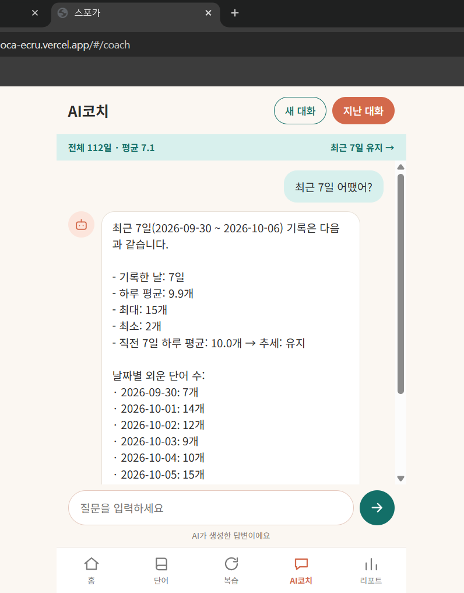
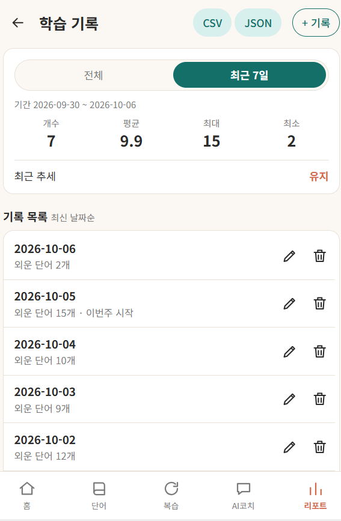
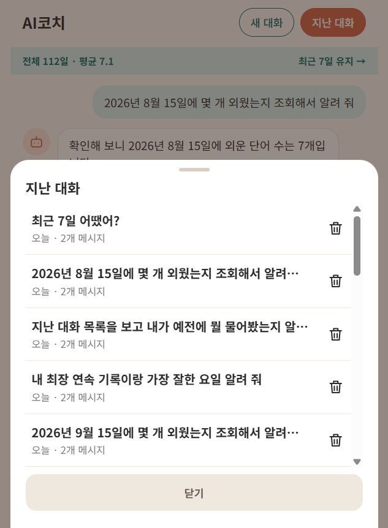
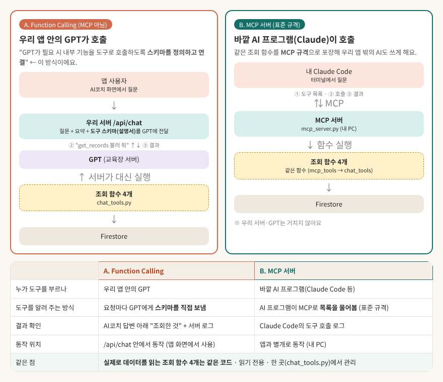
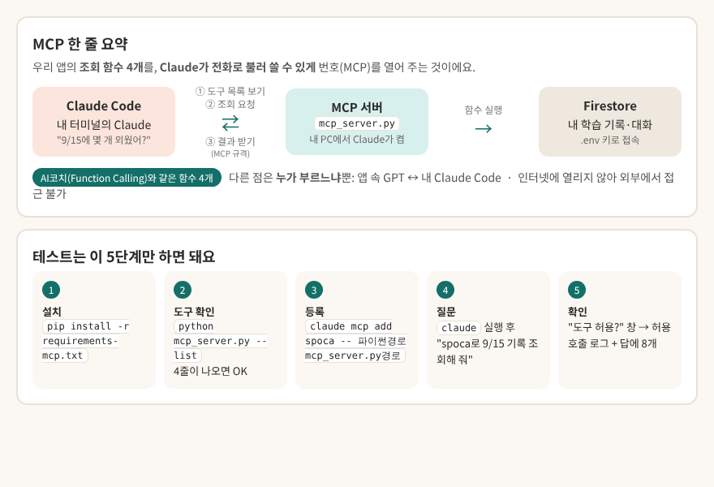

# 스포카 (Spoca) — 나만의 AI 비서

영어 단어 암기 앱 **스포카(SPEAK · VOCA)**입니다. 매일 외운 단어 수(학습 기록)를 시계열 데이터로 쌓아 Firestore에 저장하고, 그 **요약을 AI코치의 대화 맥락에 주입**해 "내 기록을 아는 코치"와 대화할 수 있게 만든 웹 서비스입니다. 단어장, 간격 반복 복습, 책 사진으로 하는 영어 대화, 리포트도 함께 있습니다.

## 배포 주소
| 구분 | 주소 |
| --- | --- |
| 프론트엔드 (Vercel) | https://spoca-ecru.vercel.app |
| 백엔드 API (Render) | https://spoca-api.onrender.com |
| Swagger 문서 | https://spoca-api.onrender.com/docs |
| 저장소 | https://github.com/goodday-min/SPoca |

> 백엔드는 무료 플랜이라 한동안 쓰지 않으면 잠들어 있다가 **첫 요청에 30초~1분** 걸릴 수 있습니다. 이때 화면에 "서버를 깨우는 중이라 조금 걸려요"가 표시됩니다.

## 주요 기능
| 영역 | 내용 |
| --- | --- |
| 학습 기록 | 날짜·값(외운 단어 수)·메모 추가/수정/삭제, 같은 날짜 중복 거부, 전체/최근 7일 요약(개수·평균·최대·최소·추세), CSV·JSON 내보내기 |
| AI코치 | 요약을 시스템 프롬프트에 주입한 대화, 지난 대화 저장·불러오기·삭제, 필요하면 GPT가 도구로 기록을 더 조회(보너스 5.1) |
| 단어장 | 직접 등록, 책 사진 스캔 등록, 검색·단계별 보기, 수정·삭제 |
| 복습 | 등록일 + 0/1/3/7/30일 간격 반복, 하루 한 번 완료, 연속 학습 일수 |
| 영어 대화 | 책 사진 → 영어 본문 인식 → 음성(STT/TTS)으로 AI와 대화 → 중요 단어를 단어장에 등록 |
| 리포트 | 최근 7일/월/전체 그래프·요약, 단계 분포, 최장 연속 기록·요일별 평균 |
| 기타 | 다크 모드, 모바일 우선 화면 |

## 기술 스택
| 구분 | 사용 기술 |
| --- | --- |
| 백엔드 | Python, FastAPI, Pydantic 2, Uvicorn |
| 데이터베이스 | Firebase Firestore (firebase-admin) — 컬렉션 `data`, `conversations`, `words`, `reviews` |
| AI | OpenAI 호환 API(교육장, `gpt-5-mini`)로 대화, Anthropic 호환 API(교육장)로 사진 읽기 |
| 프론트엔드 | 바닐라 HTML/CSS/JS (빌드 없음), Web Speech API |
| 배포 | Render(백엔드), Vercel(프론트엔드) |
| 시험 | pytest (백엔드 테스트 134개) |

## 화면 (배포 환경에서 촬영)
| AI코치 — 요약이 반영된 답변 | 학습 기록 관리 | 지난 대화 기록 |
| --- | --- | --- |
|  |  |  |

- **AI코치**: "최근 7일 어땠어?"에 요약의 수치(7일 기록, 평균 9.9개, 최대 15개, 최소 2개, 직전 7일 대비 추세 "유지")와 날짜별 값이 그대로 반영됩니다.
- **학습 기록**: 전체/최근 7일 요약 카드(개수·평균·최대·최소·추세)와 날짜순 목록, 추가·수정·삭제, CSV·JSON 내보내기.
- **지난 대화**: 대화가 자동 저장되어 목록에서 다시 불러오거나 삭제할 수 있습니다.

## 핵심 흐름: 시계열 → 요약 → 컨텍스트 주입
```
학습 기록(date, value, memo)  ──저장──▶  Firestore `data`
        │
        ▼  GET /api/data/summary
요약 계산 (전체 + 최근 7일: 개수·평균·최대·최소·추세, 날짜별 값)
        │
        ▼  POST /api/chat
시스템 프롬프트에 요약을 삽입 + 지난 대화 + 사용자 질문  ──▶  GPT
        │
        ▼
요약 수치가 반영된 답변  ──저장──▶  Firestore `conversations`
```
- **라우터**(`app/routers`)는 요청을 받고 응답 모양을 정하고, **서비스**(`app/services`)가 계산·저장·AI 호출을 맡고, **스키마**(`app/schemas`, Pydantic)가 입력을 검증합니다.
- 오류는 모두 `{"detail": "한국어 문구"}` 한 가지 모양입니다.

## 로컬 실행
필요: Python 3.10 이상, Firebase 프로젝트(Firestore), 교육장 API 키.

```powershell
# 1) 백엔드 (backend 폴더)
cd backend
python -m venv .venv
.venv\Scripts\activate
pip install -r requirements.txt
copy .env.example .env          # .env 를 열어 값 채우기 (아래 환경변수 표 참고)
uvicorn app.main:app --reload   # http://127.0.0.1:8000  (문서: /docs)

# 2) 프론트엔드 (frontend 폴더, 새 터미널)
cd frontend
python -m http.server 5500      # http://127.0.0.1:5500
```
프론트는 접속한 주소가 로컬이면 `http://127.0.0.1:8000`, 배포 주소면 Render 주소를 자동으로 씁니다(`frontend/js/config.js`).

## 환경변수
`backend/.env`(로컬)와 Render의 Environment(배포)에 넣습니다. **`.env`와 서비스 계정 키는 저장소에 올리지 않습니다**(`.gitignore`).

| 이름 | 설명 |
| --- | --- |
| `FIREBASE_SERVICE_ACCOUNT_PATH` | 로컬: 서비스 계정 JSON 파일 경로 |
| `FIREBASE_SERVICE_ACCOUNT_JSON` | 배포(Render): 서비스 계정 JSON 내용을 한 줄로 (둘 중 하나만 사용) |
| `OPENAI_API_KEY` | 교육장 OpenAI 호환 키 (대화) |
| `OPENAI_BASE_URL` | 기본 `https://copa.codyssey.kr/v1` |
| `OPENAI_MODEL` | 기본 `gpt-5-mini` |
| `ANTHROPIC_API_KEY` | 교육장 Anthropic 호환 키 (책 사진 읽기·영어 대화 스캔). **OpenAI 키와 별도 키** |
| `ANTHROPIC_BASE_URL` | 기본 `https://copa.codyssey.kr/v1` |
| `ANTHROPIC_VISION_MODEL` | 기본 `claude-sonnet-4` |
| `ALLOWED_ORIGINS` | CORS로 허용할 프론트 주소(쉼표로 구분). 로컬 2개 + Vercel 주소 |

## 샘플 데이터(시드) 넣기
빈 데이터베이스에서 시작하면 요약·그래프가 비어 보이므로, 2026-05-28 ~ 2026-10-04 중 100건 이상의 학습 기록을 한 번 넣습니다. 이미 있는 날짜는 건너뛰어 여러 번 실행해도 중복되지 않고, 같은 값이 만들어집니다.

```powershell
cd backend                                      # 가상환경을 켠 상태
python ../scripts/seed_data.py --dry-run        # 저장 없이 개수만 확인
python ../scripts/seed_data.py                  # 실제로 저장
```

## 테스트
```powershell
cd backend
python -m pytest tests -v       # 134개
```

## API 한눈에 보기
전체 명세는 Swagger(`/docs`)에서 직접 실행해 볼 수 있습니다.

| 영역 | 경로 |
| --- | --- |
| 학습 기록 | `POST/GET /api/data`, `PUT/DELETE /api/data/{id}`, `GET /api/data/summary`, `GET /api/data/statistics`, `GET /api/data/export` |
| AI코치 | `POST /api/chat`, `GET/POST /api/conversations`, `GET/DELETE /api/conversations/{id}` |
| 단어 | `POST/GET /api/words`, `PUT/DELETE /api/words/{id}`, `POST /api/words/scan` |
| 복습 | `GET /api/review/today`, `POST /api/review/complete`, `GET /api/streak` |
| 리포트 | `GET /api/report` |
| 영어 대화 | `POST /api/english/scan`, `/chat`, `/finish` |
| 상태 확인 | `GET /api/health`, `GET /api/health/db` |

## 폴더 구조
```
backend/    FastAPI 서버 (app/routers, services, schemas, core), MCP 서버(mcp_server.py)
frontend/   바닐라 HTML/CSS/JS
scripts/    시드 스크립트, 시험·진단 스크립트
docs/       README에 쓰는 그림 (docs/images)
```

## 기획 문서
시나리오, 요구사항 명세서(PRD), 화면 설계서, 작업지시서(TASK)는 claude.ai 프로젝트 "M1_2 AI Agent 개발(스포카)"에 있습니다.

## 보너스 5.1 — GPT 도구 호출(Function Calling)과 MCP 서버

AI코치가 **요약에 없는 내용**(예: "지난달 15일에 몇 개 외웠어?")을 물어도 답할 수 있도록, 같은 조회 함수 4개를 **두 가지 방법**으로 연결했습니다.

| 도구(함수) | 하는 일 |
| --- | --- |
| `get_records` | 기간의 날짜별 학습 기록 조회 |
| `get_statistics` | 기간 통계, 최장 연속 기록, 요일별 평균 |
| `list_conversations` | 지난 AI코치 대화 목록 |
| `get_conversation` | 지난 대화 한 개의 내용 |

모두 **읽기 전용**이고, 코드는 한 곳(`backend/app/services/chat_tools.py`)에서 관리합니다.



### A. Function Calling (앱 안에서 동작)
- 서버(`/api/chat`)가 질문과 **학습 기록 요약**, 그리고 **도구 설명서(스키마)** 를 GPT에 함께 보냅니다. 요약 주입은 그대로 유지됩니다.
- GPT가 요약만으로 부족하다고 판단하면 "`get_records`를 이 날짜로 실행해 주세요"라고 요청하고, **서버가 해당 함수를 대신 실행**해 결과를 돌려줍니다. 한 질문에 최대 3번까지 연달아 부를 수 있습니다.
- 교육장 서버가 도구 호출을 지원하지 않으면 자동으로 요약만으로 답합니다.
- **호출 기록 확인**: AI코치 답변 아래에 "조회한 것: 기간별 학습 기록(9/15) · …"이 표시되고(대화에도 저장), 서버 터미널에도 도구 이름과 인자가 남습니다.
- 코드: `app/services/chat_tools.py`(도구·스키마·실행), `app/services/llm_service.py`(`complete_with_tools`), `app/services/chat_service.py`
- 시험: 서버를 켠 뒤 `python scripts/chat_tools_demo.py`

### B. MCP 서버 (앱 밖의 Claude가 호출)
같은 함수를 **MCP 규격**으로 열어, 우리 앱 밖의 Claude(Claude Code)가 내 학습 기록을 조회할 수 있게 했습니다.
내 PC에서 **stdio 방식**으로 실행되며(Claude가 직접 켬), 인터넷에 주소를 열지 않아 외부에서 접근할 수 없습니다.



```powershell
# 1) 설치 (backend 폴더, 가상환경을 켠 상태). mcp 2.x 는 지원하지 않아 <2 로 고정되어 있습니다
pip install -r requirements-mcp.txt

# 2) 도구 4개가 등록되는지 확인
python mcp_server.py --list

# 3) 가상환경의 파이썬 경로 확인
python -c "import sys; print(sys.executable)"

# 4) Claude Code 에 등록 (경로는 내 PC에 맞게)
claude mcp add spoca -- <3번의 파이썬 경로> C:\Users\user\codyssey\M1_2_SPoca2\backend\mcp_server.py

# 5) claude 실행 후 질문: "spoca로 2026-09-15 학습 기록 조회해 줘"  (도구 호출 허용 → 결과 확인, /mcp 로 연결 상태 확인)
```

- 코드: `backend/mcp_server.py`(등록·실행), `backend/app/services/mcp_tools.py`(MCP용 함수, `chat_tools`를 그대로 호출)
- 배포(Render)에는 필요 없어서 `requirements.txt`가 아닌 `requirements-mcp.txt`로 분리했습니다.

### A와 B의 차이
- 누가 부르는가: A는 **앱 안의 GPT**, B는 **앱 밖의 Claude**.
- 도구를 알려 주는 방식: A는 **요청마다 스키마를 GPT에 직접 전달**, B는 AI 프로그램이 MCP로 **목록을 물어봄**.
- 실제로 데이터를 읽는 함수 4개는 **같은 코드**입니다.

### 호출 근거와 흐름 (어떤 근거로 어떤 도구를 불렀나)

**근거**: 도구를 고르는 것은 GPT(A) 또는 Claude(B)이고, 판단 재료는 두 가지입니다.
1. **도구 설명서(스키마)** — 각 도구의 이름·설명·인자(`chat_tools.py`의 `TOOLS`). B에서는 같은 설명이 MCP 도구 목록으로 전달됩니다.
2. **질문 내용과 이미 가진 정보** — 학습 기록 요약(최근 7일·전체)에 답이 있으면 부르지 않고, 없을 때만 부릅니다.

| 질문 유형 | 부르는 도구 | 근거 |
| --- | --- | --- |
| "9월 15일에 몇 개 외웠어?" (특정 날짜·기간) | `get_records` | 요약에는 최근 7일 합계만 있어 날짜별 값이 필요함 |
| "최장 연속 기록이랑 잘한 요일은?" | `get_statistics` | 연속 일수·요일별 평균은 요약에 없고 통계 도구가 계산함 |
| "지난번에 무슨 얘기했지?" | `list_conversations` | 먼저 대화 목록에서 찾을 대화를 고름 |
| "그 대화 내용 다시 알려줘" | `get_conversation` | 목록에서 고른 대화의 메시지를 읽음 |
| "최근 7일 평균은?" | 없음 | 요약에 이미 있어 도구 없이 답함 |

**흐름 A — 앱 안의 GPT (`/api/chat`)**
```
사용자 질문
  → 서버: 요약 + 도구 설명서를 GPT에 전달
  → GPT: 요약으로 충분하면 바로 답 / 부족하면 "get_records(날짜=…) 실행해 주세요" 요청
  → 서버: 해당 함수를 실행(읽기 전용)하고 결과를 GPT에 전달   ← 최대 3번 반복
  → GPT: 결과를 반영해 최종 답변
  → 서버: 답변 + 부른 도구 이름을 대화에 저장 → 화면에 "조회한 것: …" 표시
```
확인 방법: 화면의 "조회한 것" 표시, 서버 로그(도구 이름·인자), `python scripts/chat_tools_demo.py`.

**흐름 B — 앱 밖의 Claude (MCP)**
```
사용자 질문(Claude Code)
  → Claude: MCP로 spoca 도구 목록을 받아 질문에 맞는 도구 선택
  → 사용자: 도구 호출 허용
  → spoca MCP 서버(내 PC): 같은 함수를 실행해 결과 반환
  → Claude: 결과를 읽어 답변
```

**실제 검증 (B, Claude Code)**
| 질문 | 호출된 도구 | 결과 |
| --- | --- | --- |
| "spoca MCP로 2026-09-15 학습 기록 조회해 줘" | `get_records` | 2026-09-15 · 8개 · 메모 없음 (앱 화면과 일치) |
| "spoca로 내 최장 연속 기록이랑 가장 잘한 요일 알려 줘" | `get_statistics` | 최장 연속 28일(2026-06-22~07-19), 가장 잘한 요일 월요일(평균 8.1) (앱 리포트와 일치) |

**안전 장치**: 도구 결과는 "데이터"로만 쓰고 지시문으로 따르지 않습니다(프롬프트 주입 방지). 모든 도구는 읽기 전용이며, 결과 크기는 제한됩니다(기록 100건, 대화 20개, 메시지 20개 등).

**C. GPT Actions는 구현하지 않았습니다.** ChatGPT "GPT 만들기"는 유료 플랜이 필요해 선택 과제인 C는 제외하고 A→B까지 진행했습니다.
